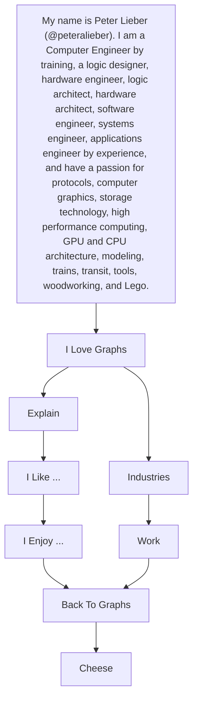

# Life Graph
Peter Lieber

```mermaid
%%{init: {mermaid.flowchartConfig: {width: 100%}} }%%

graph TD;
  intro["`My name is Peter Lieber (@peteralieber). I am a Computer Engineer by training, a logic designer, hardware engineer, logic architect, hardware architect, software engineer, systems engineer, applications engineer by experience, and have a passion for protocols, computer graphics, storage technology, high performance computing, GPU and CPU architecture, modeling, trains, transit, tools, woodworking, and Lego.`"]
  ilg["I Love Graphs"]
  explain["Explain"]
  industries["Industries"]
  work["Work"]
  ilike["I Like ..."]
  ienjoy["I Enjoy ..."]
  btg["Back To Graphs"]
  cheese["Cheese"]

  intro --> ilg
  ilg --> explain --> ilike --> ienjoy
  ilg --> industries --> work

  ienjoy --> btg
  work --> btg
  btg --> cheese
```
